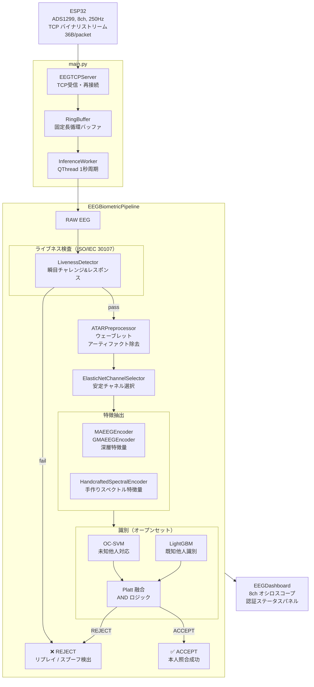

# EEG 生体認証システム（研究プロトタイプ）

脳波（EEG）を用いた **1:1 防御的生体認証**の研究プロトタイプです。  
ESP32 から送信される EEG をリアルタイムで受信し、なりすましとプレゼンテーション攻撃を検知しながら本人照合を行います。

> **倫理・スコープ**：本実装は学術目的のプロトタイプです。MNE-Python の公開サンプルデータまたは NumPy で合成した波形のみを使用します。実在の個人データ収集・本番運用は対象外です。

---

## システム概要

```
ESP32 (ADS1299, 8ch, 250Hz)
    │  TCP バイナリストリーム (36B/packet)
    ▼
main.py  ─── EEGTCPServer ──► RingBuffer
              │
              InferenceWorker (QThread)
              │
              eeg_biometric.pipeline.EEGBiometricPipeline
              │
              ┌──────────────────────────────────────────┐
              │ RAW  ─► LivenessDetector (pre-ATAR)      │
              │  │pass               │fail → REJECT       │
              │  └─► ATAR ─► Elastic-Net ─► MAEEG/手作り │
              │              埋め込み ─► OC-SVM⊕LightGBM  │
              │                          AND ─► ACCEPT   │
              └──────────────────────────────────────────┘
              │
              EEGDashboard (PyQtGraph GUI)
              8ch オシロスコープ + 認証ステータスパネル
```

### システムフロー図（Mermaid）



---

## リポジトリ構成

```
.
├── main.py                  # リアルタイムダッシュボード（PyQtGraph GUI）
└── eeg_biometric/           # サーバ側推論パイプライン（Pythonパッケージ）
    ├── __init__.py
    ├── dsp.py               # 共通DSP（PSD・帯域パワー・ロバストz・ピーク検出）
    ├── data.py              # EEGDataSource / EEGTrial（MNE + 合成フォールバック）
    ├── preprocess.py        # ATARPreprocessor（ウェーブレットアーティファクト除去）
    ├── channels.py          # ElasticNetChannelSelector（安定チャネル選択）
    ├── features.py          # MAEEGEncoder / GMAEEGEncoder / HandcraftedSpectralEncoder
    ├── recognition.py       # OpenSetRecognizer（OC-SVM ⊕ LightGBM）
    ├── liveness.py          # LivenessDetector（ISO/IEC 30107 能動チャレンジ&レスポンス）
    ├── adversarial.py       # EEG-GAN / サロゲート生成 + なりすましレッドチーム
    ├── pipeline.py          # EEGBiometricPipeline 統合 + デモ
    ├── requirements.txt     # 依存パッケージ
    ├── README.md            # サブパッケージ詳細（英語）
    └── README.ja.md         # サブパッケージ詳細（日本語）
```

---

## インストール

```bash
# 最小構成（NumPy のみ）
pip install numpy pyqtgraph PyQt5

# 推奨（全機能）
pip install -r eeg_biometric/requirements.txt
pip install pyqtgraph PyQt5
```

### 依存関係とフォールバック

| パッケージ | 有効になる機能 | 無い場合のフォールバック |
|---|---|---|
| `numpy` | （必須） | — |
| `scipy` | Butterworth/Welch/`find_peaks` | FFT / 局所最大 |
| `PyWavelets` | 本来の ATAR（WPD/DWT） | ロバスト振幅減衰 |
| `scikit-learn` | Elastic-Net + OC-SVM + スケーリング | NumPy ロジスティック + マハラノビス |
| `lightgbm` | LightGBM ブースティング枝 | 勾配ブースティング / ロジスティック回帰 |
| `torch` | MAEEG/GMAEEG + EEG-GAN | 手作りエンコーダ + 位相ランダム化サロゲート |
| `mne` | PhysioNet EEGBCI 公開データ | NumPy 合成波形 |

---

## 実行方法

### 1. リアルタイムダッシュボード（`main.py`）

```bash
python main.py
```

- `0.0.0.0:8888` で TCP 待受を開始します。
- ESP32 が接続されていなくてもGUI内の **「シミュレータ開始」** ボタンで内蔵シグナルシミュレータが起動し、合成EEGをリアルタイム受信できます。
- 起動時に `eeg_biometric.pipeline` を使って自動登録（enroll）を実行します。失敗した場合は信号ヒューリスティックによるダミー判定にフォールバックします。

#### パケット仕様（ESP32 側）

```
36バイト・リトルエンディアン: uint32 タイムスタンプ + float32 × 8ch
フォーマット文字列: "<I8f"
ポート: 8888
```

### 2. パイプライン単体デモ（`eeg_biometric/pipeline.py`）

```bash
# 親ディレクトリから
python -m eeg_biometric.pipeline

# または
cd eeg_biometric && python pipeline.py
```

5つのシナリオ（本人受理・他人拒否・リプレイ拒否・タイミング不一致拒否・GAN スプーフ拒否）を実行し、FAR / FRR / ACC を表示します。

---

## 主要コンポーネント

### `eeg_biometric` パッケージ

| コンポーネント | 説明 |
|---|---|
| **ATAR前処理** | ウェーブレット（WPD/DWT）で瞬目・筋電を除去。単一チャネル・低遅延でストリーミングに適合 |
| **Elastic-Net チャネル選択** | Stability selection で容積伝導の相関を考慮しつつ安定した電極セットを抽出 |
| **MAEEG / GMAEEG** | 6層conv → 8層Transformer（192→64次元）のマスク自己符号化器。事前学習重み未同梱のため、デフォルトは HandcraftedSpectralEncoder |
| **OC-SVM ⊕ LightGBM** | One-Class SVM（未知他人対応オープンセット）と LightGBM（既知他人の識別）を Platt 融合 |
| **LivenessDetector** | ISO/IEC 30107 準拠。ランダムな時間窓への瞬目をチャレンジとして、リプレイ・スプライス攻撃を拒否 |
| **EEG-GAN / サロゲート** | 登録データ拡張とレッドチーム用（防御目的のみ） |

### `main.py` ダッシュボード

| コンポーネント | 説明 |
|---|---|
| **EEGTCPServer** | TCP 受信スレッド。部分受信バッファリング・再接続対応 |
| **RingBuffer** | `threading.Lock` で保護された固定長循環バッファ |
| **InferenceWorker** | 1秒ごとに推論窓を切り出して認証を実行する QThread |
| **SignalSimulator** | ESP32 不在時のテスト用 TCP 合成シグナル送信スレッド |
| **EEGDashboard** | 8ch オシロスコープ + Liveness / スコア / 判定結果のステータスパネル |

---

## 詳細ドキュメント

- [eeg_biometric/README.md](eeg_biometric/README.md) — 設計判断・アーキテクチャ詳細（英語）
- [eeg_biometric/README.ja.md](eeg_biometric/README.ja.md) — 設計判断・アーキテクチャ詳細（日本語）

---

## ライセンス

本リポジトリは研究・教育目的のプロトタイプです。実運用・商用利用・実在個人データへの適用は想定していません。
